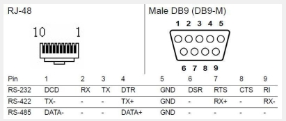

# Adam 4571L Information


## Connectors

>RJ-48:
Pin 1: DCD
Pin 2: RXD
Pin 3: TXD
Pin 4: DTR
Pin 5: GND
Pin 6: DSR
Pin 7: RTS
Pin 8: CTS
Pin 9: RI
Pin 10: NC

>Male D-sub 9-pin:
Pin 1: DCD
Pin 2: RXD
Pin 3: TXD
Pin 4: DTR
Pin 5: GND
Pin 6: DSR
Pin 7: RTS
Pin 8: CTS
Pin 9: RI




## Try to connect with ESP-32-Wroom-Dev1

```txt
                                  __________________________ 
                                  | .--------------------. |
                                  | .   ~~~~~~~~~~~~~~   . |
                                  | .   ~~~~~~~~~~~~~~   . |
VP   [OK] ADC1 (RO)              | [ ]                 [x] | D23 <— Used for Fan-Relay
VN   [OK] ADC1 (RO)              | [ ]                 [x] | D22 <— I2C_SCL
D34  [OK] ADC1 (RO)              | [ ]                 [ ] | GPIO1 (TXD) <— UART TX ([WARNING] avoid if possible)
D35  [OK] ADC1 (RO)              | [ ]                 [ ] | GPIO3 (RXD) <— UART RX ([WARNING] avoid if possible)
D32  [OK] ADC1                   | [ ]                 [x] | D21 <— I2C_SDA
D33  [OK] ADC1                   | [ ]                 [x] | D19 [INFO] no ADC (Tx Pin for Serial2 = RS232-to-RS485)
D25  [WARNING] ADC2              | [ ]                 [x] | D18 [INFO] no ADC (Rx Pin for Serial2 = RS232-to-RS485)
D26  [WARNING] ADC2              | [ ]                 [ ] | D5  [INFO] no ADC
D27  [WARNING] ADC2              | [ ]                 [ ] | D17 [INFO] no ADC
D14  [WARNING] ADC2              | [ ]                 [ ] | D16 [INFO] no ADC
D12  [WARNING] ADC2 (boot pin)   | [ ]                 [ ] | D4  [WARNING] ADC2 (boot pin)
D13  [INFO] no ADC (Btn-AP-Mode) | [x]                 [x] | D15 [WARNING] ADC2 (boot pin - must be LOW on boot) (Used for Reset Button)
EN                                | [ ]                 [ ] | GND
VIN (5V!)                         | [ ]                 [ ] | 3V3
                                  |                         |
                                  |   [pwr-LED]  [D2-LED]   |               
                                  |        _______          |
                                  |        |     |          |
                                  '--------|-----|---------'

Legend:
[x] in use    - Pin is already used in your project
[OK] ADC1      - 12-bit ADC, usable even with WiFi
[OK] ADC1 (RO) - Input-only pins with ADC1 (GPIO36–39)
[WARNING] ADC2 - 12-bit ADC, unusable when WiFi is active
[INFO] no ADC  - No analog capability
[WARNING] Boot pin - Must be LOW or unconnected at boot to avoid boot failure

Notes:
- GPIO0, GPIO2, GPIO12, GPIO15 are boot strapping pins — avoid pulling HIGH at boot.
- GPIO6–11 are used for internal flash – **never use**.
- GPIO1 (TX) and GPIO3 (RX) are used for serial output – use only if UART0 not needed.

- EN: Pull LOW to reset the ESP32. When released HIGH, the ESP32 boots.
- VIN (5V!) is the power input pin, connect to 5V.
- VP (GPIO36) ADC1 (RO) No Pull-up/down possible.
- VN (GPIO39) ADC1 (RO) No Pull-up/down possible.

| UART  | TX    | RX    |
| ----- | ----- | ----- |
| UART0 | GPIO1 | GPIO3 |
| UART1 | GPIO10 | GPIO9 |
| UART2 | GPIO17 | GPIO16 |

```


## Pinout

TTL side MAX3232 → ESP32

R1OUT (from ADAM-TX) → ESP32-RX0 GPIO3

T1IN (to ADAM-RX) ← ESP32-TX0 GPIO1

R2OUT (from ADAM-RTS) → RTS_TTL

R3OUT (from ADAM-DTR) → DTR_TTL

GND ↔ GND, VCC = 3.3 V from the ESP32

Tip: Some MAX3232 breakouts only provide 1×TX/1×RX. You need at least 2 receive channels (TX+RTS+DTR are 3 signals in total), so use a board with multiple channels or two modules.

## Alternative

| Item | Example | Price | Notes |
| ---- | ------- | ----- | ----- |
| Raspberry Pi Zero 2 W | e.g. BerryBase or Amazon | 18–22 € | Small, low-power, has WiFi for remote access |
| MicroSD card 16 GB | SanDisk Ultra | 4–5 € | For the Pi OS |
| USB power supply 5 V / 2 A | phone charger | 5 € | Stable power supply |
| USB-UART adapter with auto-program | CP2102 or CH340G with DTR/RTS (e.g. AZDelivery CP2102) | 5–8 € | Must expose DTR & RTS |
| Micro-USB OTG cable | OTG adapter for Pi Zero | 3 € | So the USB-UART is connected to the Pi |


Wiring plan

USB-UART adapter → ESP32

TX → RX0 (GPIO3)

RX → TX0 (GPIO1)

DTR → GPIO0 (Boot)

RTS → EN (Reset)

GND → GND

USB-UART adapter → Raspberry Pi

Connect via an OTG cable to the USB port of the Pi Zero.

### Software setup (short)

Write Pi OS Lite to the MicroSD card.

Log in via SSH.

Install usbip:

```sh
sudo apt update
sudo apt install linux-tools-$(uname -r) linux-modules-extra-$(uname -r) usbip
```


Start the USBIP daemon:

```sh
sudo modprobe usbip_host
sudo usbipd -D
```


List devices:

```sh
usbip list -l
```

Bind device:

```sh
sudo usbip bind -b BUSID
```

On your PC, install the usbip client and attach:

```sh
usbip attach -r PI_IP -b BUSID
```


