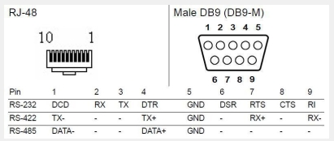

# Adam 4571L Information


## Connectors

>RJ-48:
Pin 1: DCD
Pin 2: RXD
Pin 3: TXD
Pin 4: DTR
Pin 5: GND
Pin 6: DSR
Pin 7: RTS
Pin 8: CTS
Pin 9: RI
Pin 10: NC

>Male D-sub 9-pin:
Pin 1: DCD
Pin 2: RXD
Pin 3: TXD
Pin 4: DTR
Pin 5: GND
Pin 6: DSR
Pin 7: RTS
Pin 8: CTS
Pin 9: RI




## Try to connect with ESP-32-Wroom-Dev1

```txt
                                  __________________________ 
                                  | .--------------------. |
                                  | .   ~~~~~~~~~~~~~~   . |
                                  | .   ~~~~~~~~~~~~~~   . |
VP   ✅ ADC1 (RO)                | [ ]                 [x] | D23 <— Used for Fan-Relay
VN   ✅ ADC1 (RO)                | [ ]                 [x] | D22 <— I2C_SCL
D34  ✅ ADC1 (RO)                | [ ]                 [ ] | GPIO1 (TXD) <— UART TX (⚠️ avoid if possible)
D35  ✅ ADC1 (RO)                | [ ]                 [ ] | GPIO3 (RXD) <— UART RX (⚠️ avoid if possible)
D32  ✅ ADC1                     | [ ]                 [x] | D21 <— I2C_SDA
D33  ✅ ADC1                     | [ ]                 [x] | D19 ❌ no ADC (Tx Pin for Serial2 = RS232-to-RS485)
D25  ⚠️ ADC2                     | [ ]                 [x] | D18 ❌ no ADC (Rx Pin for Serial2 = RS232-to-RS485)
D26  ⚠️ ADC2                     | [ ]                 [ ] | D5  ❌ no ADC
D27  ⚠️ ADC2                     | [ ]                 [ ] | D17 ❌ no ADC
D14  ⚠️ ADC2                     | [ ]                 [ ] | D16 ❌ no ADC
D12  ⚠️ ADC2 (boot pin)          | [ ]                 [ ] | D4  ⚠️ ADC2 (boot pin)
D13  ❌ no ADC (Btn-AP-Mode)     | [x]                 [x] | D15 ⚠️ ADC2 (boot pin - must be LOW on boot) (Used for Reset Button)
EN                                | [ ]                 [ ] | GND
VIN (5V!)                         | [ ]                 [ ] | 3V3
                                  |                         |
                                  |   [pwr-LED]  [D2-LED]   |               
                                  |        _______          |
                                  |        |     |          |
                                  '--------|-----|---------'

Legend:
[x] in use    - Pin is already used in your project
✅ ADC1        - 12-bit ADC, usable even with WiFi
✅ ADC1 (RO)   - Input-only pins with ADC1 (GPIO36–39)
⚠️ ADC2        - 12-bit ADC, unusable when WiFi is active
❌ no ADC     - No analog capability
⚠️ Boot pin   - Must be LOW or unconnected at boot to avoid boot failure

Notes:
- GPIO0, GPIO2, GPIO12, GPIO15 are boot strapping pins — avoid pulling HIGH at boot.
- GPIO6–11 are used for internal flash – **never use**.
- GPIO1 (TX) and GPIO3 (RX) are used for serial output – use only if UART0 not needed.

- EN Turn to Low to reset the ESP32. On goint High, the ESP32 boots.
- VIN (5V!) is the power input pin, connect to 5V.
- VP (GPIO36) ADC1 (RO) No Pull-up/down possible.
- VN (GPIO39) ADC1 (RO) No Pull-up/down possible.

UART	TX	RX
UART0	GPIO1	GPIO3
UART1	GPIO10	GPIO9
UART2	GPIO17	GPIO16

```


## Pinout

TTL-Seite MAX3232 → ESP32

R1OUT (vom ADAM-TX) → ESP32-RX0 GPIO3

T1IN (zum ADAM-RX) ← ESP32-TX0 GPIO1

R2OUT (vom ADAM-RTS) → RTS_TTL

R3OUT (vom ADAM-DTR) → DTR_TTL

GND ↔ GND, VCC = 3,3 V vom ESP32

Tipp: Einige MAX3232-Breakouts haben nur 1×TX/1×RX. Du brauchst mind. 2 Empfangskanäle (für TX+RTS+DTR insgesamt 3), also ein Board mit mehreren Kanälen oder zwei Module.

## anders

Raspberry Pi Zero 2 W	z. B. BerryBase oder Amazon	18 – 22 €	Klein, stromsparend, hat WLAN für Remote
MicroSD-Karte 16 GB	SanDisk Ultra	4 – 5 €	Für das Pi-OS
USB-Netzteil 5 V/2 A	Handy-Ladegerät	5 €	Stabile Stromversorgung
USB-UART-Adapter mit Auto-Program	CP2102 oder CH340G mit DTR/RTS (z. B. AZDelivery CP2102)	5 – 8 €	Muss DTR & RTS herausführen
Micro-USB OTG Kabel	OTG-Adapter für Pi Zero	3 €	Damit der USB-UART am Pi hängt


Anschlussplan

USB-UART-Adapter → ESP32

TX → RX0 (GPIO3)

RX → TX0 (GPIO1)

DTR → GPIO0 (Boot)

RTS → EN (Reset)

GND → GND

USB-UART-Adapter → Raspberry Pi

Per OTG-Kabel in den USB-Port des Pi Zero

### Software-Setup (Kurzfassung)

Pi OS Lite auf MicroSD schreiben.

Per SSH einloggen.

usbip installieren:
sudo apt update
sudo apt install linux-tools-$(uname -r) linux-modules-extra-$(uname -r) usbip


USBIP-Daemon starten:

sudo modprobe usbip_host
sudo usbipd -D


Gerät listen:

usbip list -l

Gerät freigeben:
sudo usbip bind -b <BUSID>

Auf deinem PC usbip-Client installieren und verbinden:

usbip attach -r <IP_DES_PI> -b <BUSID>


